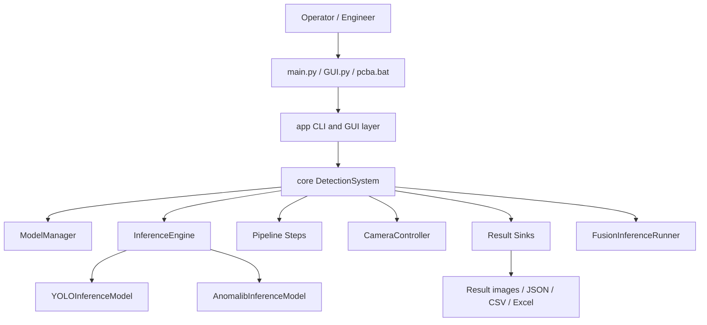
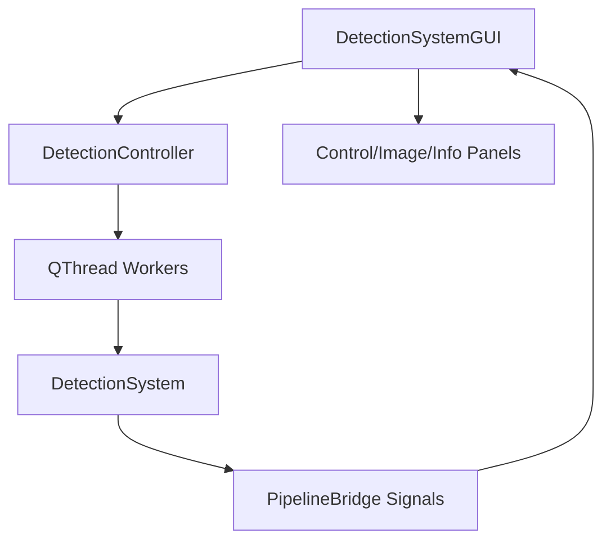

# Module Architecture

Traditional Chinese version: [MODULE_ARCHITECTURE_ZH_TW.md](MODULE_ARCHITECTURE_ZH_TW.md)

This document describes the current `yolo11_inference` runtime architecture. It
is meant to help engineers find the right module before changing behavior.

## Classification

Class B: business/internal production tooling with CV inference. The code needs
clear module ownership, testable boundaries and safe resource handling, but it
should not be forced into enterprise-style layers where simple functions are
enough.

## High-Level Layers

## Entrypoints

| Entrypoint | Purpose | Notes |
| --- | --- | --- |
| `main.py` | CLI interactive or one-shot inference | `--type` currently accepts `yolo` and `anomalib` |
| `GUI.py` | PyQt GUI and packaged exe entrypoint | Handles packaged diagnostics such as `--check-hikrobot-runtime` |
| `pcba.bat` | Operator wrapper for PCBA pilot commands | Calls `tools/pcba_pilot.py` with the project Python when available |
| `tools/*.py` | Focused operations tools | Readiness, review collection, benchmark, dataset export |

The PyInstaller spec builds `yolo11_inference.exe` from `GUI.py`. Do not assume
that every packaged exe flag is accepted by `python main.py`.

## Core Runtime

### `core/detection_system.py`

`DetectionSystem` is the runtime orchestrator. It owns:

- global config loading;
- product/area/type config merge through `ModelManager`;
- camera lifecycle;
- inference engine lifecycle;
- sync `detect(...)`;
- async `start_pipeline(...)` / `stop_pipeline()`;
- result sink refresh and shutdown;
- runtime preflight checks where relevant.

The class is intentionally a facade because GUI, CLI and tools need one stable
entrypoint. Keep business decisions in services or pipeline steps when they can
be isolated.

### `core/services/model_manager.py`

`ModelManager` loads `models/<product>/<area>/<type>/config.yaml`, applies
model-level overrides onto a copy of the base config, and manages an LRU cache
of initialized engines.

State safety:

- config overrides are applied to a deep copy, not the shared base config;
- cached engines are guarded by a lock;
- returned config snapshots are copied before use.

### `core/inference_engine.py`

`InferenceEngine` dispatches inference to lazy-loaded backends:

- `YOLOInferenceModel` for YOLO artifacts;
- `AnomalibInferenceModel` for Anomalib configs;
- optional custom backends under the `core.backends.` prefix.

Lazy loading keeps YOLO-only startup fast and avoids importing the full
Anomalib/Lightning stack until required.

### `core/fusion_inference.py`

Fusion combines YOLO and Anomalib results when both backends are available for a
product/area. GUI/API paths can use fusion; the current `main.py --type` CLI
does not expose `fusion`.

### `core/pipeline/*`

The pipeline registry builds configured processing steps such as color checks,
count checks, sequence checks, position logic and result saving. Use pipeline
steps for optional per-product behavior instead of adding product-specific
branches inside `DetectionSystem`.

### `core/services/results/*`

The result services handle:

- output path management;
- annotation images;
- failure crops;
- Excel buffering;
- JSON/CSV-style traceability;
- operator/customer-facing messages.

Result writing is intentionally separate from inference so tests can validate
decision behavior without real camera or GPU dependencies.

## Camera Layer

| Module | Responsibility |
| --- | --- |
| `camera/camera_controller.py` | high-level camera lifecycle used by core |
| `camera/MVS_camera_control.py` | Hikrobot MVS SDK integration |
| `camera/preview/*` | preview app and metrics |

Packaged camera diagnostics are implemented in `GUI.py` so they are available
inside `yolo11_inference.exe`.

## GUI Layer

### `app/gui/main_window.py`

Owns the main Qt window and connects UI panels, controller actions and display
updates. It should coordinate UI state, not implement inspection logic.

### `app/gui/controller.py`

`DetectionController` is the application coordinator. It lazily creates
`DetectionSystem`, builds workers and reloads model settings. It should not own
domain decisions.

### `app/gui/workers.py`

Workers move blocking operations off the UI thread:

- model catalog loading;
- camera initialization;
- detection pipeline execution;
- shutdown.

Use worker signals for UI updates. Avoid direct widget mutation from background
threads.

## Sync Detection Flow

1. CLI/GUI calls `DetectionSystem.detect(product, area, inference_type, frame)`.
2. `DetectionSystem` loads and merges the product config.
3. `ModelManager` returns an engine/config pair.
4. `InferenceEngine` lazy-loads the requested backend if needed.
5. Backend returns raw inference results.
6. Result adapter normalizes output into `DetectionResult`.
7. Pipeline/finalization logic computes status and reason codes.
8. Result sink writes evidence according to config.

## Async Detection Flow

1. GUI builds `DetectionWorker`.
2. Worker starts `DetectionSystem.start_pipeline(...)`.
3. `AsyncPipelineManager` coordinates acquisition, inference and storage.
4. Queues decouple camera capture from model inference and disk I/O.
5. Stop requests call `stop_pipeline()` and flush pending storage work.

The async path is useful for high-FPS or continuous inspection, but one-shot
CLI inference remains simpler for validation and debugging.

## Configuration Ownership

| Config | Owner | Notes |
| --- | --- | --- |
| `config.yaml` | global runtime defaults | not necessarily production-ready for PCBA |
| `config.example.yaml` | template | safe starting point, not a validated product config |
| `models/<product>/<area>/<type>/config.yaml` | product model/runtime config | readiness gate should target this file for pilot |
| `configs/products/*.yaml` | product examples/templates | not a substitute for measured fixture values |

External inputs are treated as untrusted: product, area, type and paths are
validated or normalized before use.

## State And Concurrency Safety

- GUI work that can block is routed through `QThread` workers.
- Model cache access is protected by a lock.
- Config switching uses copied config snapshots.
- Output paths are constrained under the project root by security helpers.
- Async queues prevent unbounded frame buildup.

Avoid adding shared mutable state directly to GUI widgets, workers or global
module variables. If state must be shared, make the owner explicit and document
the lifecycle.

## Extension Rules

Use the smallest extension point that fits the change:

- New product or area: add a model config and weights under `models/`.
- New optional post-processing behavior: add or configure a pipeline step.
- New inference backend: add a backend under `core.backends.` and enable custom
  backends explicitly.
- New operator workflow: add a focused tool under `tools/` or extend
  `tools/pcba_pilot.py`.
- New UI behavior: keep UI state in `app/gui`, domain decisions in `core`.

Do not add a new interface or factory unless there is a real second
implementation or a clear variation axis.

