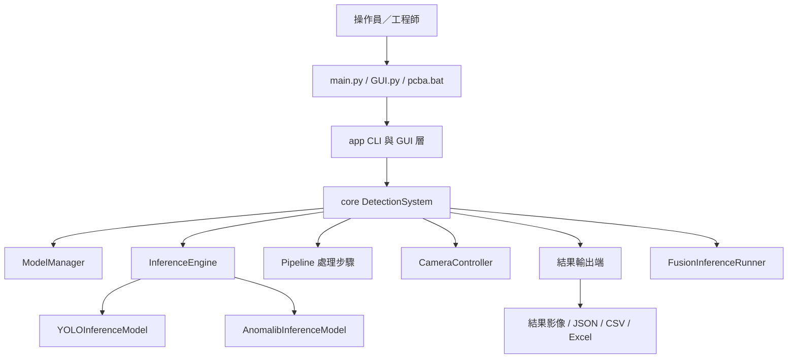
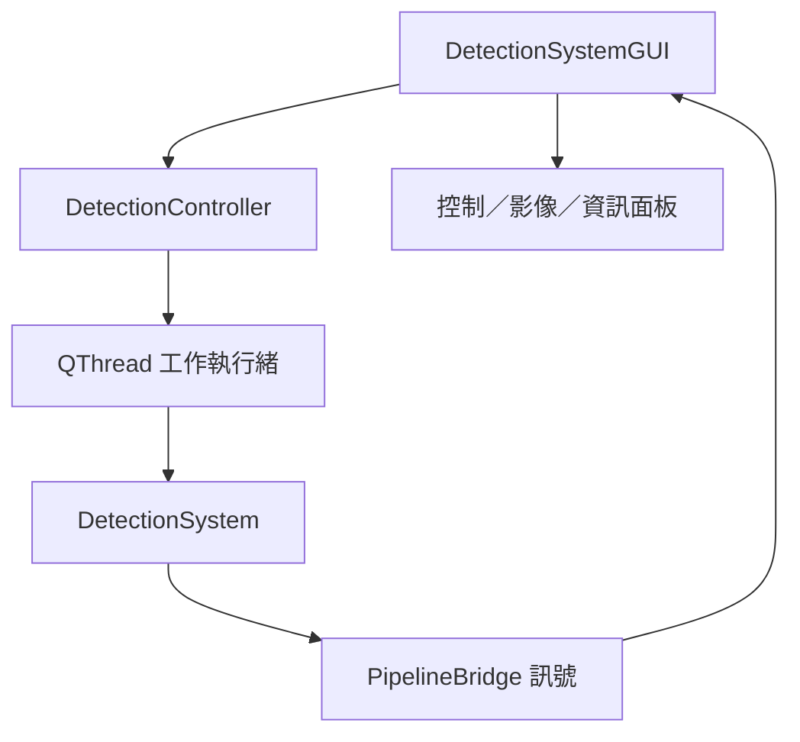

# 模組架構

英文原文：[MODULE_ARCHITECTURE.md](MODULE_ARCHITECTURE.md)

本文件說明目前 `yolo11_inference` 的執行階段架構，協助工程師在變更系統行為前，找到正確的模組。

## 系統分類

B 類：具備電腦視覺推論功能的商業／內部生產工具。程式碼必須具備清楚的模組歸屬、可測試的邊界及安全的資源管理；若簡單函式已足以解決問題，則不應強制套用企業級分層。

## 高階分層

## 程式進入點

| 進入點 | 用途 | 備註 |
| --- | --- | --- |
| `main.py` | CLI 互動式或單次推論 | `--type` 目前接受 `yolo` 與 `anomalib` |
| `GUI.py` | PyQt GUI 與封裝後的執行檔進入點 | 處理 `--check-hikrobot-runtime` 等封裝版診斷功能 |
| `pcba.bat` | PCBA 試產指令的操作員包裝程式 | 專案 Python 可用時，呼叫 `tools/pcba_pilot.py` |
| `tools/*.py` | 特定維運工具 | 就緒檢查、複核資料收集、效能評測、資料集匯出 |

PyInstaller 設定檔以 `GUI.py` 建置 `yolo11_inference.exe`。不要假設封裝執行檔接受的每個旗標，也同樣適用於 `python main.py`。

## 核心執行階段

### `core/detection_system.py`

`DetectionSystem` 是執行階段的協調器，負責：

- 載入全域設定；
- 透過 `ModelManager` 合併產品／區域／類型設定；
- 管理相機生命週期；
- 管理推論引擎生命週期；
- 同步執行 `detect(...)`；
- 非同步執行 `start_pipeline(...)`／`stop_pipeline()`；
- 重新整理及關閉結果輸出端；
- 視需要執行執行階段的前置檢查。

這個類別刻意採用 Facade（外觀）模式，因為 GUI、CLI 與工具都需要一個穩定的進入點。業務決策若能獨立，應放在服務或 Pipeline 處理步驟中。

### `core/services/model_manager.py`

`ModelManager` 載入 `models/<product>/<area>/<type>/config.yaml`，將模型層級的覆寫值套用至基礎設定的副本，並管理已初始化推論引擎的 LRU 快取。

狀態安全措施：

- 設定覆寫套用至深層複製的副本，而非共享的基礎設定；
- 使用鎖保護快取中的推論引擎；
- 回傳設定快照前會先建立副本。

### `core/inference_engine.py`

`InferenceEngine` 將推論分派至延遲載入的後端：

- YOLO 產物使用 `YOLOInferenceModel`；
- Anomalib 設定使用 `AnomalibInferenceModel`；
- 選用的自訂後端放在 `core.backends.` 前綴之下。

延遲載入可維持僅使用 YOLO 時的啟動速度，並避免在真正需要前載入完整的 Anomalib／Lightning 技術堆疊。

### `core/fusion_inference.py`

當某個產品／區域同時具備 YOLO 與 Anomalib 後端時，融合推論會合併兩者的結果。GUI／API 路徑可以使用融合推論；目前 `main.py --type` CLI 尚未提供 `fusion` 選項。

### `core/pipeline/*`

Pipeline Registry 會依設定建立處理步驟，例如顏色檢查、數量檢查、順序檢查、位置邏輯及結果儲存。產品專屬的選用行為應以 Pipeline 處理步驟實作，不要在 `DetectionSystem` 內加入產品專屬的條件分支。

### `core/services/results/*`

結果服務負責：

- 管理輸出路徑；
- 產生標註影像；
- 裁切失敗區域；
- 緩衝 Excel 輸出；
- 提供 JSON／CSV 形式的可追溯性；
- 產生面向操作員／客戶的訊息。

結果寫入刻意與推論分離，使測試不依賴實體相機或 GPU，也能驗證決策行為。

## 相機層

| 模組 | 職責 |
| --- | --- |
| `camera/camera_controller.py` | 核心層使用的高階相機生命週期管理 |
| `camera/MVS_camera_control.py` | Hikrobot MVS SDK 整合 |
| `camera/preview/*` | 預覽應用程式與指標 |

封裝版的相機診斷功能實作於 `GUI.py`，因此可在 `yolo11_inference.exe` 內使用。

## GUI 層

### `app/gui/main_window.py`

負責主 Qt 視窗，並連接 UI 面板、控制器動作與畫面更新。它應協調 UI 狀態，不應實作檢測邏輯。

### `app/gui/controller.py`

`DetectionController` 是應用層協調器。它以延遲方式建立 `DetectionSystem`、建立 Worker，並重新載入模型設定；不應負責領域決策。

### `app/gui/workers.py`

Worker 將阻塞操作移出 UI 執行緒，包括：

- 載入模型目錄；
- 初始化相機；
- 執行檢測 Pipeline；
- 關閉系統。

使用 Worker 訊號更新 UI。避免從背景執行緒直接修改 Widget。

## 同步檢測流程

1. CLI／GUI 呼叫 `DetectionSystem.detect(product, area, inference_type, frame)`。
2. `DetectionSystem` 載入並合併產品設定。
3. `ModelManager` 回傳推論引擎與設定組合。
4. `InferenceEngine` 視需要延遲載入指定的後端。
5. 後端回傳原始推論結果。
6. 結果 Adapter 將輸出正規化為 `DetectionResult`。
7. Pipeline／最終處理邏輯計算狀態與原因代碼。
8. 結果輸出端依設定寫入證據。

## 非同步檢測流程

1. GUI 建立 `DetectionWorker`。
2. Worker 啟動 `DetectionSystem.start_pipeline(...)`。
3. `AsyncPipelineManager` 協調取像、推論及儲存。
4. Queue 將相機取像與模型推論、磁碟 I/O 解耦。
5. 停止要求會呼叫 `stop_pipeline()`，並完成待處理的儲存工作。

非同步路徑適合高 FPS 或連續檢測；單次 CLI 推論則較簡單，適合驗證與除錯。

## 設定歸屬

| 設定 | 歸屬 | 備註 |
| --- | --- | --- |
| `config.yaml` | 全域執行階段預設值 | 不一定符合 PCBA 正式生產要求 |
| `config.example.yaml` | 範本 | 可作為安全的起點，但不是已驗證的產品設定 |
| `models/<product>/<area>/<type>/config.yaml` | 產品模型／執行階段設定 | 試產的就緒 Gate 應以此檔案為檢查目標 |
| `configs/products/*.yaml` | 產品範例／範本 | 不可取代實際量測的治具數值 |

所有外部輸入均視為不可信任；產品、區域、類型及路徑在使用前都會經過驗證或正規化。

## 驗收證據層

驗收工作區與檢測 Pipeline 是分開的：它重跑既有照片以產生可比較的證據，不寫入
正式檢測結果，也不改動人工真值。詳細操作見
[模型組合驗收與發布](../model_lifecycle/MODEL_COMBINATION_ACCEPTANCE.md)。

### `core/services/acceptance_artifacts.py`

擁有「一次推論用了哪些檔案」這個邊界。`AcceptanceArtifactBundle` 把 global
config、model config、權重、選用顏色模型與逐色修訂綁成一組內容定址的組合；
`verify_acceptance_artifact_bundle()` 在推論前後各驗證一次。所有驗收進入點
（GUI 主視窗、矩陣、gate、headless）都必須經由 bundle 取得路徑，不得自行組裝，
否則報告記載的檔案可能不是推論實際載入的檔案。

`color_scope_model_type()` 也在此：顏色 artifact 的 scope 中 fusion 併入 yolo。
這條規則只能有一份實作。

### `core/services/acceptance_runs.py`

`AcceptanceRunRepository` 讓互動式推論成為原子操作。每個樣本的結果先寫進該次
run 目錄，狀態轉移以 append-only 事件記錄，全部完成後才提交 manifest。失敗或
取消時原本的正式結果不變。

### `core/services/model_acceptance.py`

`AcceptanceRepository` 擁有 manifest（`ground_truth.csv`）。所有變更都在
`_exclusive_mutation()` 之下，批次提交使用 checksum compare-and-swap。清除舊
結果以 `artifact_bundle_sha256` 為判準，不是以 run 為判準——快照需要的性質是
「所有結果來自同一組 artifact」，不是「來自同一次執行」。

`calculate_acceptance_metrics()` 是全函式（total function）：它在顯示與報告路徑
上被呼叫，因此損壞的資料列會被計為 `malformed` 並排除於分母之外，而不是拋出
例外。拒絕的責任屬於 gate 與正式快照這兩個決策點。

### `tools/cross_process_lock.py`

供短暫 metadata 變更使用的跨行程檔案鎖：同行程以 `threading.RLock`、跨行程以
位元組範圍鎖。不要在持有此鎖期間執行推論或其他長時間 I/O。

### `app/gui/metric_presentation.py`

`format_count_with_rate()` 讓每個指標以 `張數（比率）`呈現於單一儲存格。不要把
張數與比率拆到相鄰欄位：整體判定與只歸因於顏色的兩組指標分母相同而分子不同，
拆開呈現會讓讀者以為可以互相換算。

## 狀態與並發安全

- 可能造成阻塞的 GUI 工作會交由 `QThread` Worker 執行。
- 使用鎖保護模型快取的存取。
- 切換設定時使用設定快照的副本。
- 安全輔助函式會將輸出路徑限制在專案根目錄之下。
- 非同步 Queue 可避免 Frame 無限制累積。
- 驗收 manifest 的變更同時受同行程鎖與跨行程檔案鎖保護，批次提交另以 checksum
  compare-and-swap 防止覆蓋他人結果。
- GUI 端保存的標註圖預覽是有上限的快取：以顯示尺寸儲存並淘汰最久未檢視者。
  全解析度、無上限的 QPixmap 快取曾在數百張的批次中耗盡繪圖堆積並使行程直接
  結束，且不留 Python traceback。任何新增的影像快取都必須同時限制尺寸與數量。

不要直接在 GUI Widget、Worker 或全域模組變數中加入共享的可變狀態。若必須共享狀態，應明確指定其擁有者並記錄生命週期。

## 擴充規則

選擇足以完成變更的最小擴充點：

- 新增產品或區域：在 `models/` 下新增模型設定與權重。
- 新增選用的後處理行為：新增或設定 Pipeline 處理步驟。
- 新增推論後端：在 `core.backends.` 下新增後端，並明確啟用自訂後端。
- 新增操作員工作流程：在 `tools/` 下新增專用工具，或擴充 `tools/pcba_pilot.py`。
- 新增 UI 行為：將 UI 狀態保留在 `app/gui`，將領域決策保留在 `core`。

除非確實存在第二個實作或明確的變化軸，否則不要新增 Interface 或 Factory。
